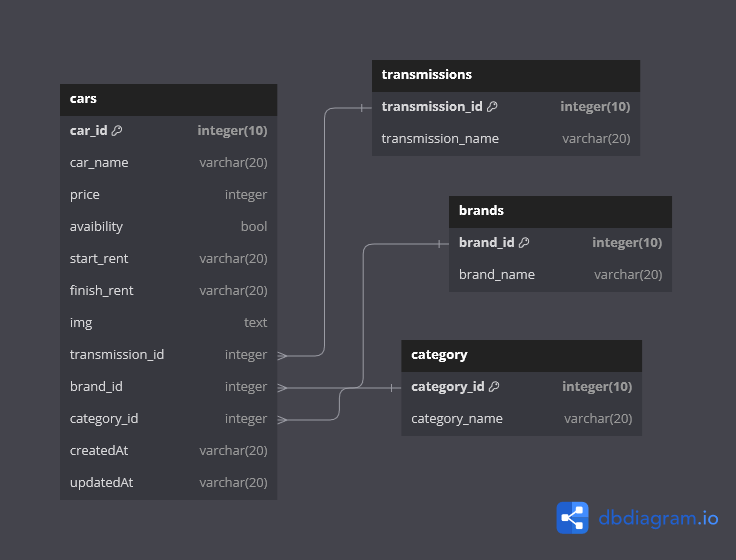

# Challenge Chapter 5 - REST API With Media Handling
Challenge Chapter 5 - REST API Binar Car Rental with Express Js, Typescript, Postgres

## Install App
1. Clone project into your local `git clone https://github.com/wahyupambudi/24001118-snyrgy7-wahyupambudi-bcr-ch5.git`
2. Change directory to this project folder `cd 24001118-snyrgy7-wahyupambudi-bcr-ch5`
3. Use command `npm install` to install all packages
4. Copy `.env.example` file to `.env` and fill up the correct value of your PostgreSQL connection and cloudinary secret key!
5. Run command `npm run migration:latest` to create table via migration
6. Run command `npm run dev`

# REST API
The REST API for Binar Car Rental
- CRUD Transmissions
- CRUD Brands
- CRUD Categories
- CRUD Cars

## Get All Cars
### Request
`GET /cars/`

    curl -L -X GET "localhost:3000/cars/"

### Response
    {
        "message": "Success",
        "cars": [
            {
                "id": 1,
                data
            },
            {
                "id": 2,
                data
            }
        ]
    }

## Get Cars By Id
### Request
`GET /cars/:id`

    curl -L -X GET "localhost:3000/cars/1"

### Response
    {
        "message": "Success",
        "car": {
            "id": 1,
            data
        }
    }

## Create New Car
### Request
`POST /cars/add`

    curl -L -X POST "localhost:3000/cars/add" -H "Content-Type: multipart/form-data" -F "car_name=\"Pagani Zonda\"" -F "price=\"Rp.100.000\"" -F "avaibility=\"true\"" -F "start_rent=\"2024-05-20\"" -F "end_rent=\"2024-05-25\"" -F "img=@\"/path/img.jpg\"" -F "transmission_id=\"1\"" -F "brand_id=\"1\"" -F "category_id=\"1\""

### Response
    {
        "message": "Success",
        "cars": {
           dataCar
        }
    }

## Update Car
### Request
`PUT /cars/update/:id`

    curl -L -X PUT "localhost:3000/cars/update/3" -H "Content-Type: multipart/form-data" -H "User-Agent: insomnia/9.1.1" -F "car_name=\"Pagani Zonda Update\"" -F "price=\"Rp.100.000\"" -F "avaibility=\"true\"" -F "start_rent=\"2024-05-20\"" -F "end_rent=\"2024-05-25\"" -F "img=@\"path/img.jpg\"" -F "transmission_id=\"1\"" -F "brand_id=\"1\"" -F "category_id=\"1\""

### Response
    {
        "message": "Success",
        "cars": {
           dataCar
        }
    }

## Delete Car
### Request
`DELETE /cars/:id`

    curl -L -X DELETE "localhost:3000/cars/3" -H "Content-Type: application/x-www-form-urlencoded" -H "User-Agent: insomnia/9.1.1" -d "="

### Response
    {
        "message": "Success",
        "cars": {
            dataCar
        }
    }

## ERD

